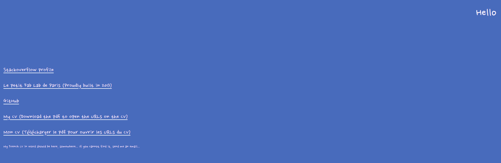

## Welcome to my webpage

After leaving the README.MD almost untouched for 2 years-ish with a cryptic message (`This space is used for various tests`), I thought about writing a decent README yesterday after creating decent READMEs for two of my personal projects, I've been working on, namely [Kidding Python](https://github.com/kw-andy/kidding_python) and the [rust tutorial](https://github.com/kw-andy/rust-tutorial).

This is the webpage, I've created a few years ago now. It evolved slowly to host the links to things I've been working the last few years: 

* The questions I've asked on StackOverflow
* My personal projects on Github
* The Fablab/Hackerspace I've co-founded, Le Petit Fablab de Paris
* And my CV's in English and French

Everything on that space is influx, so likely it will change in the near future with maybe adding a blog and probably something else.

